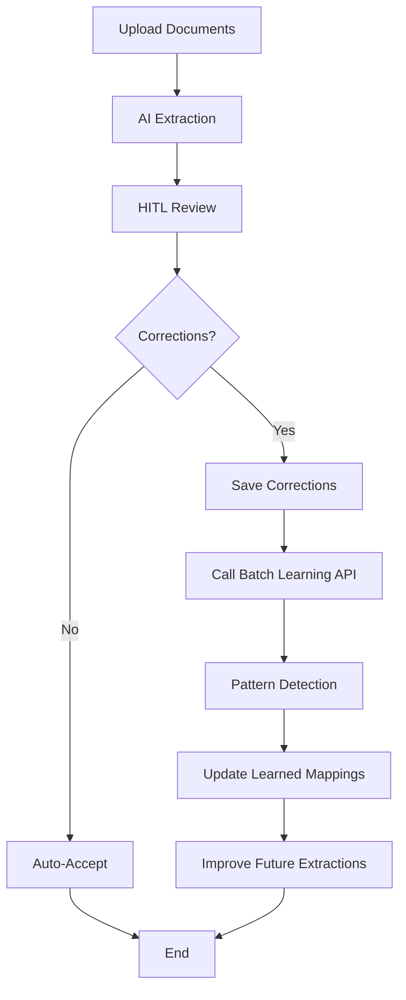

# Batch Learning - Guida Completa

Il sistema di **Batch Learning** consente al sistema THEMIS di apprendere automaticamente dalle correzioni apportate agli item estratti durante il processo HITL (Human-in-the-Loop).

## 📚 Cos'è il Batch Learning?

Il Batch Learning analizza le sessioni di correzione per identificare pattern ricorrenti e migliorare progressivamente:
- Mappature di campi
- Trasformazioni di valori
- Classificazioni di tipo
- Confidence scoring

## 🚀 Come Funziona

### 1. Processo di Ingestion
Quando gli utenti caricano documenti:
1. Il sistema estrae gli item con AI
2. Gli item vengono presentati per revisione (HITL)
3. L'utente corregge eventuali errori
4. Le correzioni vengono salvate

### 2. Attivazione del Batch Learning

Il batch learning si attiva chiamando l'endpoint API dopo una sessione di correzione:

```typescript
POST /api/ingestion/batch-learning
Content-Type: application/json

{
  "tenantId": "company-uuid",
  "batchId": "batch-request-id",
  "originalItems": [
    {
      "id": "item-1",
      "name": "Original Product Name",
      "type": "product",
      "category": "Software",
      "confidence": 0.65
    }
  ],
  "correctedItems": [
    {
      "id": "item-1",
      "name": "Corrected Product Name",
      "type": "product",
      "category": "SaaS",
      "confidence": 0.95
    }
  ]
}
```

### 3. Pattern Detection

Il sistema analizza le differenze tra `originalItems` e `correctedItems` per rilevare:

#### A. Field Mapping Patterns
Se gli utenti correggono ripetutamente `"Prodotto"` → `"Product"`:
- Crea una regola di mappatura appresa
- Applica automaticamente nelle prossime sessioni

#### B. Value Transformations
Se gli utenti trasformano ripetutamente `"EUR 1.000,00"` → `1000.00`:
- Apprende il pattern di parsing
- Normalizza automaticamente valori simili

#### C. Type Classifications
Se gli utenti correggono ripetutamente `service` → `product`:
- Identifica caratteristiche distintive
- Migliora la classificazione automatica

## 🎯 Requisiti per Pattern Detection

### Soglie Minime
```typescript
const MINIMUM_CORRECTIONS = 3; // Almeno 3 occorrenze per creare un pattern
```

Il sistema richiede **almeno 3 correzioni simili** in un batch per considerare un pattern valido.

### Pattern Supportati

1. **Field Mappings** (Semantic Field Mapping)
   - Source pattern → Target field
   - Memorizzato in `learned_field_mappings` con embedding

2. **Template Updates** (Normalization Templates)
   - Aggiornamento template di normalizzazione
   - Confidence progressiva

3. **Confidence Adjustments** (Progressive Confidence)
   - Learning rate: 0.1
   - Decay rate: 0.05
   - Context-aware (tenant, industry, format, field)

## 📊 Visualizzazione dei Risultati

### API Response
```json
{
  "success": true,
  "message": "Batch learning completed"
}
```

### Verifica Pattern Appresi
```typescript
GET /api/ingestion/confidence-dashboard/:tenantId

// Include metriche su pattern appresi:
{
  "fieldStats": [
    {
      "fieldName": "category",
      "avgConfidence": 0.85,  // Migliorata dopo batch learning
      "lowConfidenceCount": 3 // Ridotto dopo apprendimento
    }
  ]
}
```

## 🔄 Workflow Completo HITL + Batch Learning



## 💻 Implementazione nel Frontend

### Esempio: AdvancedIngestionUploader

```typescript
// Dopo che l'utente ha corretto gli item nella UI HITL
async function handleSaveCorrections(
  originalItems: IngestedItem[],
  correctedItems: IngestedItem[]
) {
  // 1. Salva gli item corretti nel database
  await saveItemsToDatabase(correctedItems);

  // 2. Attiva batch learning (opzionale ma consigliato)
  if (originalItems.length >= 3) {
    try {
      await fetch('/api/ingestion/batch-learning', {
        method: 'POST',
        headers: {
          'Content-Type': 'application/json',
          'Authorization': `Bearer ${token}`,
        },
        body: JSON.stringify({
          tenantId: user.companyId,
          batchId: ingestionRequestId,
          originalItems,
          correctedItems,
        }),
      });
      console.log('✅ Batch learning completed');
    } catch (error) {
      console.error('❌ Batch learning failed:', error);
      // Non bloccare il flusso se batch learning fallisce
    }
  }
}
```

## 📈 Monitoring e Analytics

### Confidence Trends
Monitora il miglioramento della confidence nel tempo:
```typescript
GET /api/ingestion/confidence-trends/:tenantId?days=30

{
  "daily": [
    {
      "date": "2026-01-01",
      "avgConfidence": 0.72,
      "itemCount": 10
    },
    {
      "date": "2026-01-03",  // Dopo batch learning
      "avgConfidence": 0.85,  // +18% improvement
      "itemCount": 12
    }
  ],
  "trend": "improving",
  "changePercent": 18.05
}
```

### Source Performance
Verifica quali fonti di enrichment beneficiano del batch learning:
```typescript
GET /api/ingestion/source-performance/:tenantId

{
  "sources": [
    {
      "name": "learned_patterns",  // Patterns appresi
      "avgConfidence": 0.92,
      "usageCount": 45,
      "successRate": 0.96
    }
  ]
}
```

## 🔧 Configurazione Avanzata

### Disabilitare Batch Learning (se necessario)
```typescript
// In enhancedIngestionOrchestrator.ts
export async function processBatchLearning(
  tenantId: string,
  batchId: string,
  originalItems: NormalizedItem[],
  correctedItems: NormalizedItem[],
  options?: {
    enablePatternDetection?: boolean;  // Default: true
    minPatternOccurrences?: number;    // Default: 3
    enableConfidenceAdjustment?: boolean; // Default: true
  }
): Promise<void> {
  // ...
}
```

### Quality Gates per Batch Learning
Configura quality gates per forzare batch learning su sessioni con bassa confidence:

```sql
INSERT INTO quality_gates (company_id, gate_name, gate_type, threshold, operator, description, is_blocking, applies_to)
VALUES (
  'company-uuid',
  'Batch Learning Required',
  'custom',
  0.70,
  '<',
  'If average batch confidence is below 70%, batch learning must be executed',
  true,
  'ingestion'
);
```

## 📚 Files Correlati

### Backend
- [backend/src/agents/subagents/enhancedIngestionOrchestrator.ts](backend/src/agents/subagents/enhancedIngestionOrchestrator.ts#L237-L261) - `processBatchLearning()`
- [backend/src/services/ingestion/batchLearner.ts](backend/src/services/ingestion/batchLearner.ts) - Core batch learning logic
- [backend/src/services/ingestion/confidenceAdjuster.ts](backend/src/services/ingestion/confidenceAdjuster.ts) - Progressive confidence adjustment
- [backend/src/routes/enhanced-ingestion.routes.ts](backend/src/routes/enhanced-ingestion.routes.ts#L223-L256) - Batch learning endpoint

### Database
- `learned_field_mappings` - Pattern mappatura appreso
- `item_confidence_metrics` - Tracking confidence per item
- `quality_gates` - Configurazione quality gates

### Frontend
- [frontend/components/portfolio/AdvancedIngestionUploader.tsx](frontend/components/portfolio/AdvancedIngestionUploader.tsx) - HITL UI
- [frontend/components/portfolio/HITLIngestionFlow.tsx](frontend/components/portfolio/HITLIngestionFlow.tsx) - HITL workflow
- [frontend/components/portfolio/SmartValidationWorkflow.tsx](frontend/components/portfolio/SmartValidationWorkflow.tsx) - Validazione smart

## ⚡ Best Practices

### 1. Esegui Batch Learning Dopo Ogni Sessione HITL
```typescript
// ✅ Good
onHITLComplete(originalItems, correctedItems) {
  await processBatchLearning(tenantId, batchId, originalItems, correctedItems);
}

// ❌ Bad - Mai eseguire batch learning senza almeno 3 correzioni
onHITLComplete(originalItems, correctedItems) {
  if (correctedItems.length < 3) return; // Skip
  await processBatchLearning(...);
}
```

### 2. Monitora i Trend di Confidence
Controlla regolarmente il Confidence Dashboard per verificare i miglioramenti.

### 3. Rivedi Pattern Appresi
Verifica periodicamente i pattern appresi in `learned_field_mappings` per eliminare pattern errati.

## 🐛 Troubleshooting

### Batch Learning Non Migliora la Confidence

**Possibili cause:**
1. **Correzioni insufficienti**: Minimo 3 correzioni simili
2. **Pattern non ricorrenti**: Le correzioni sono troppo diverse tra loro
3. **Context mismatch**: Pattern appresi in contesto diverso (es. settore diverso)

**Soluzione:**
- Aumenta il numero di correzioni per batch
- Verifica che le correzioni siano consistenti
- Controlla i weight di context in `confidenceAdjuster.ts`

### Pattern Appresi Incorretti

**Cause:**
- Correzioni errate inserite dagli utenti
- Pattern troppo generici

**Soluzione:**
```sql
-- Elimina pattern appreso errato
DELETE FROM learned_field_mappings
WHERE id = 'pattern-id';

-- Oppure disabilita temporaneamente
UPDATE learned_field_mappings
SET confidence = 0.0
WHERE id = 'pattern-id';
```

## ✅ Checklist di Attivazione

- [x] ✅ Batch Learning implementato (`batchLearner.ts`)
- [x] ✅ Endpoint API disponibile (`POST /api/ingestion/batch-learning`)
- [x] ✅ Test di integrazione passing (14/14)
- [x] ✅ Database migrations applicate
- [ ] 🔄 Integrare chiamata API nel flusso HITL frontend
- [ ] 🔄 Configurare quality gates per batch learning
- [ ] 🔄 Monitorare confidence trends dopo prime sessioni

---

**🎓 Il Batch Learning è ATTIVO e pronto all'uso!**

Per domande o supporto, consulta la [documentazione completa](../AI-INGESTION-ENHANCEMENTS-COMPLETE.md).
